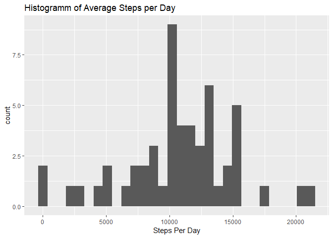
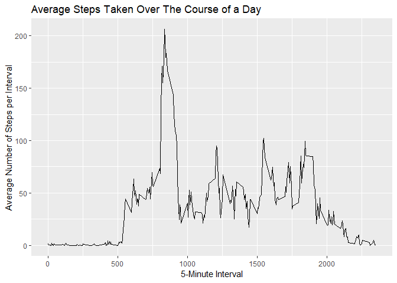
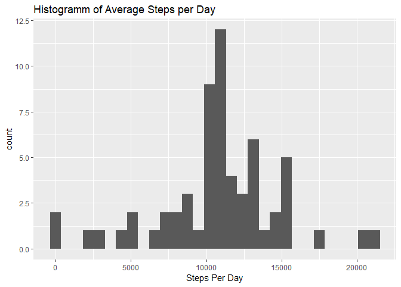
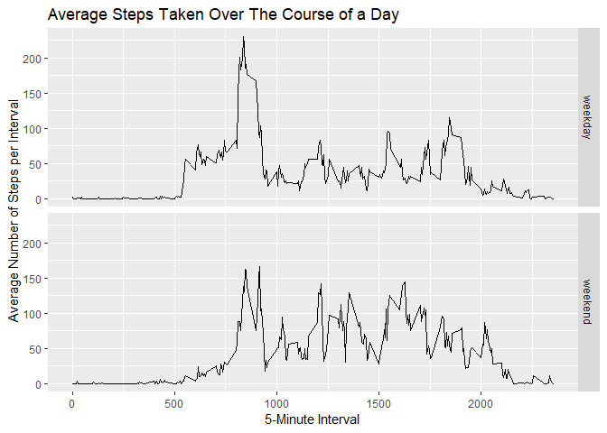

## Loading packages
First, let's load all packages that we make use of for this assignment.

```r
library(tidyverse)
```
This is the only code chunk where I supressed the output, as it is non-informative and would just clutter the document.

## Loading and preprocessing the data
Now we can read in the data from the provided csv file (which I have already unzipped in my working directory).

```r
data <- read_csv("activity.csv")
```

```
## Parsed with column specification:
## cols(
##   steps = col_double(),
##   date = col_date(format = ""),
##   interval = col_double()
## )
```

```r
str(data)
```

```
## Classes 'spec_tbl_df', 'tbl_df', 'tbl' and 'data.frame':	17568 obs. of  3 variables:
##  $ steps   : num  NA NA NA NA NA NA NA NA NA NA ...
##  $ date    : Date, format: "2012-10-01" "2012-10-01" ...
##  $ interval: num  0 5 10 15 20 25 30 35 40 45 ...
##  - attr(*, "spec")=
##   .. cols(
##   ..   steps = col_double(),
##   ..   date = col_date(format = ""),
##   ..   interval = col_double()
##   .. )
```
The `read_csv` command automatically recognizes the variables as containing double and data values. There does not seem to be a need to further tidy up the data.

## What is mean total number of steps taken per day?
As the data is provided for 5-minute intervalls, we first have to sum up the steps taken for each day before we can plot the data.

```r
daily <- data %>% group_by(date) %>% 
    summarise(StepsPerDay = sum(steps))

ggplot(data = daily, aes(x = StepsPerDay)) + 
    geom_histogram() + 
    labs(title = "Histogramm of Average Steps per Day", x = "Steps Per Day")
```

<!-- -->

The histogramm shows that, on most days, around 10000 steps have been recorded.

This is underlined when looking at summary statistics.


```r
summary(daily$StepsPerDay)
```

```
##    Min. 1st Qu.  Median    Mean 3rd Qu.    Max.    NA's 
##      41    8841   10765   10766   13294   21194       8
```
The median and mean number of steps per day are 10765 and 10766, respectively. The maximum number of steps recorded overall was 21194, while there is no data for 8 days.

## What is the average daily activity pattern?
In order to find a daily pattern we can look at the average steps taken, grouped by the provided 5-minute intervalls.


```r
pattern <- data %>% group_by(interval) %>% 
    summarise(StepsPerInt = mean(steps, na.rm = TRUE))

ggplot(data = pattern, aes(x = interval, y = StepsPerInt)) + 
    geom_line() +
    labs(title = "Average Steps Taken Over The Course of a Day", 
        x = "5-Minute Interval", y = "Average Number of Steps per Interval")
```

<!-- -->

We can see from the chart that there is a spike around the 800th interval. Let's have a closer look.


```r
max(pattern$StepsPerInt)
```

```
## [1] 206.1698
```
The maximum number of average steps taken for a 5-minute intervall is 206.


```r
pattern$interval[which(pattern$StepsPerInt == max(pattern$StepsPerInt))]
```

```
## [1] 835
```
The interval associated with this value is interval number 835.


## Imputing missing values

```r
sum(is.na(data$steps))
```

```
## [1] 2304
```
Overall, there are 2304 observations with missing values in the dataset. In order to fill these missings, I will use the mean number of steps for the respective intervals. One easy way to do this is by writing a function to get the interval mean, which is already stored in the pattern dataset.

```r
getIntervalMean <- function(interval) {
    pattern[pattern$interval == interval,]$StepsPerInt
}
```

Now we can simply loop over all rows and replace missing values with the mean number of steps for the respective interval. We will store the complete dataset in a new object.


```r
data_complete <- data
for (i in 1:length(data_complete$steps)) {
    if(is.na(data_complete$steps[i])) {
        data_complete$steps[i] <- getIntervalMean(data_complete$interval[i])
    }
}
```
Let's inspect the filled in dataset...


```r
daily_imputed <- data_complete %>% group_by(date) %>% 
    summarise(StepsPerDay = sum(steps))

ggplot(data = daily_imputed, aes(x = StepsPerDay)) + 
    geom_histogram() + 
    labs(title = "Histogramm of Average Steps per Day", x = "Steps Per Day")
```

<!-- -->

```r
summary(daily_imputed$StepsPerDay)
```

```
##    Min. 1st Qu.  Median    Mean 3rd Qu.    Max. 
##      41    9819   10766   10766   12811   21194
```
The histogramm and the summary statistics look very similar, but we don't have any missing values any more. The median and mean are now both at 10766.

## Are there differences in activity patterns between weekdays and weekends?
In order to find out we first have to add a new factor variable to the dataset, which indicates whether a particular day falls on a weekend or not.

```r
weekend_fun <- function(weekday) {
    if(weekday %in% c("Montag", "Dienstag", "Mittwoch", "Donnerstag", "Freitag")) {
        return(0)
    }
    else if(weekday %in% c("Samstag", "Sonntag")) {
        return(1)
    }
}

data_complete$weekend <- sapply(weekdays(data_complete$date), weekend_fun)
data_complete$weekend <- factor(data_complete$weekend, labels = c("weekday", "weekend"))
```

Now we can plot the pattern for weekdays against the one for weekends and see whether there is any difference.


```r
pattern_weekend <- data_complete %>% group_by(weekend,interval) %>% 
    summarise(StepsPerInt = mean(steps, na.rm = TRUE))

ggplot(data = pattern_weekend, aes(x = interval, y = StepsPerInt)) + 
    geom_line() +
    facet_grid(rows = vars(weekend)) +
    labs(title = "Average Steps Taken Over The Course of a Day", 
        x = "5-Minute Interval", y = "Average Number of Steps per Interval")
```

<!-- -->

We can see that the patterns over the day differ a bit. While the highest spike around that interval 800 is much higher for weekdays than for weekends, later intervals on weekends exhibit higher average numbers of steps than on weekdays.
